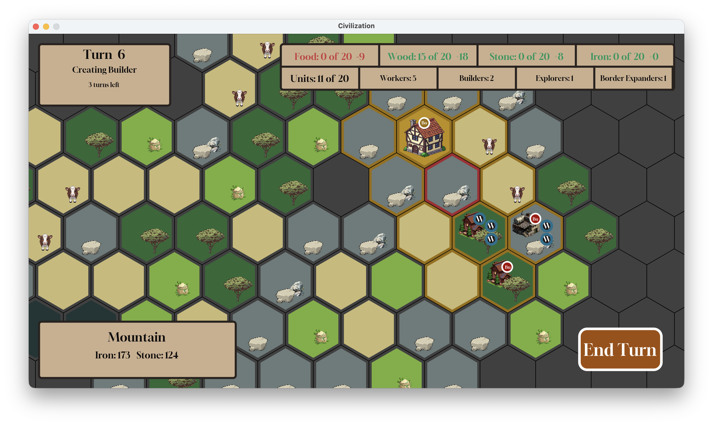

# Civilization style hex-based strategy game
This was my Advanced Programming course final project (winter 2026). It's a 2d sandbox game which you can start exploring the hexagonal world and build
some special buildings for gatering resources and creating new units. after all you will have an economical system that need to be managed.

## Features

- Hex-based world
- Unit movement
- Resource management
- Building system
- Fog of war
- Turn-based gameplay

## Technologies

- Java
- Java Swing

## How to Play

| Action      | Control         |
| ----------- | --------------- |
| Move camera | WASD            |
| Select      | Left click      |
| Zoom        | +/-             |
| End turn    | End Turn button |

